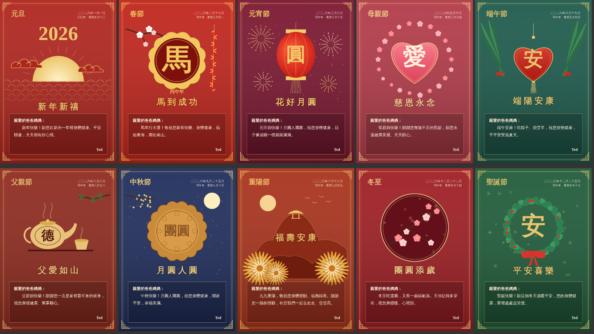

# 年節賀卡坊

給家中長輩的傳統喜氣賀卡產生器。單一 HTML 檔，不需要安裝或建置，用瀏覽器打開 `index.html` 就能使用。

## 功能

- **10 個節日**：重陽、冬至、聖誕、元旦、春節、元宵、母親節、端午、父親節、中秋。每個節日有兩套傳統風格的圖，可用「換一張」切換。
- **選西元年就自動帶日期**：支援 2026–2036 年。賀卡右上角會自動填入中文數字的國曆日期、干支年和農曆日期，例如「二〇三〇年二月三日／庚戌年 農曆正月初一」。
- **生肖跟著年份換**：春節的吉祥話與生肖圓章會依年份改變，例如 2030 狗年是「旺年納福」。
- **稱呼與署名**：可以選「爸爸媽媽」「爺爺奶奶」等稱呼，也可以自己輸入；署名預設為 Ted。
- **祝賀詞**：每個節日三種寫法，可「換一句」或「複製祝賀文字」貼到 LINE。
- **下載圖片**：「下載賀卡圖片」會存成 1000×1400 的 PNG，和畫面上的預覽完全一樣。

## 日期資料

- 春節、元宵、端午、中秋、重陽的國曆日期已對照公開的歷年日期表。2027 年春節是 2/6、2030 年是 2/3，這兩年瀏覽器內建農曆會差一天，所以以日期表為準。
- 冬至依天文時刻換算成台灣時間（12/21 或 12/22）。
- 聖誕、元旦、母親節、父親節的農曆日期由農曆換算而來，極少數情況可能差一天。
- 元旦在春節之前，干支年算前一年。

日期表寫在 `index.html` 的 `TABLE` 常數裡；要延伸年份，就在表裡加一年的資料。

## 檔案

- `index.html`：整個產生器，包含繪圖、日期表與介面。
- `docs/`：樣板預覽圖。
